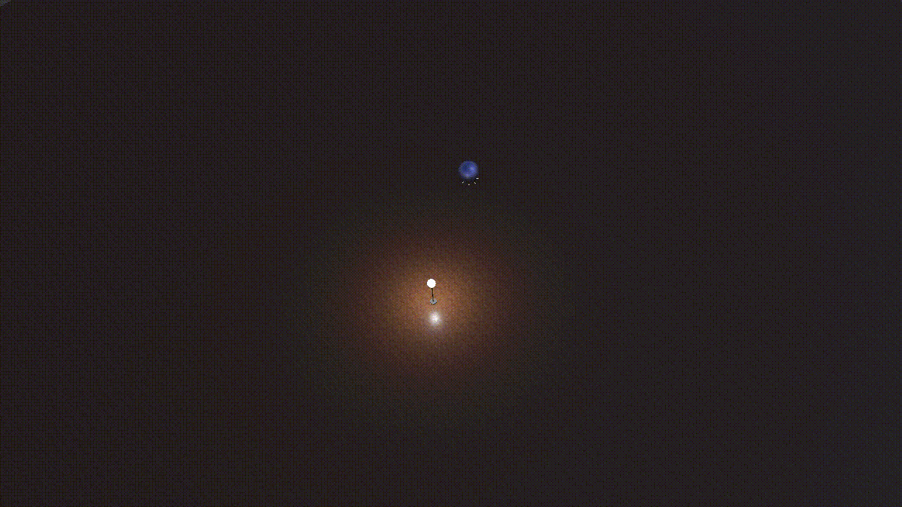

# Exploiting Light To Enhance The Endurance and Navigation of Lighter-Than-Air Micro-Drones

This repository contains the code and the demo for the IMWUT 2025 submission **Exploiting Light To Enhance The Endurance and Navigation of Lighter-Than-Air Micro-Drones**.
The code will be released once the paper get accepted.

# Three Light Seeking Navigation Algorithm in Simulation Demo

### (a) Drone Navigation using BAG Algorithm.

### (b) Drone Navigation using DES Algorithm

### (c) Drone Navigation using DGA Algorithm
