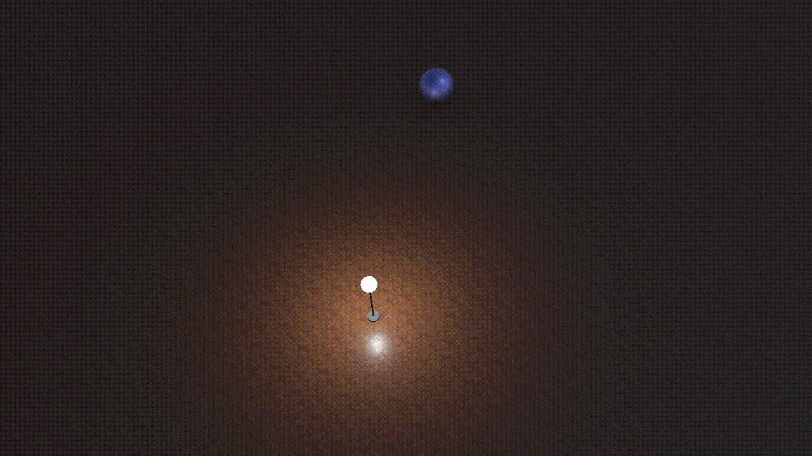

# Exploiting Light To Enhance The Endurance and Navigation of Lighter-Than-Air Micro-Drones

This repository contains the code and the demo for the IMWUT 2025 submission **Exploiting Light To Enhance The Endurance and Navigation of Lighter-Than-Air Micro-Drones**.
The code will be released once the paper get accepted.

# Three Light Seeking Navigation Algorithm in Simulation Demo

We first demo the three algorithm performance in the simulation environment. The video(a) is the drone guiding by the single light in the center using Bearing Angle Guidance(BAG) Algorithm. The video(b) is the drone guiding using Dither Extremum Seeking(DES) Algorithm. The video(c) is the drone navigating using Dither-Free Gradient Ascent(DGA).

| (a) BAG Algorithm | (b) DES Algorithm | (c) DGA Algorithm |
| :---: | :---: | :---: |
|  |  |  |

# Three Light Seeking Navigation Algorithm in indoor environment

We now demonstrate the real-world performance first in a 7x7 m^2 indoor environment. The drone is initialized at a distance of 7m away from the light. 

| (a) BAG Algorithm | (b) DES Algorithm | (c) DGA Algorithm |
| :---: | :---: | :---: |
|  |  |  |

# Three Light Seeking Navigation Algorithm in outdoor environment
