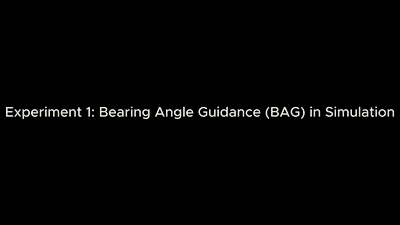

# Exploiting Light To Enhance The Endurance and Navigation of Lighter-Than-Air Micro-Drones

This repository contains the code and the demo for the IMWUT 2025 submission **Exploiting Light To Enhance The Endurance and Navigation of Lighter-Than-Air Micro-Drones**.
The code will be released once the paper get accepted.

## Demo

*The GIF above is a compressed inline preview. For the full high-quality video, please download [figures/Combined.mp4](figures/Combined.mp4).*

